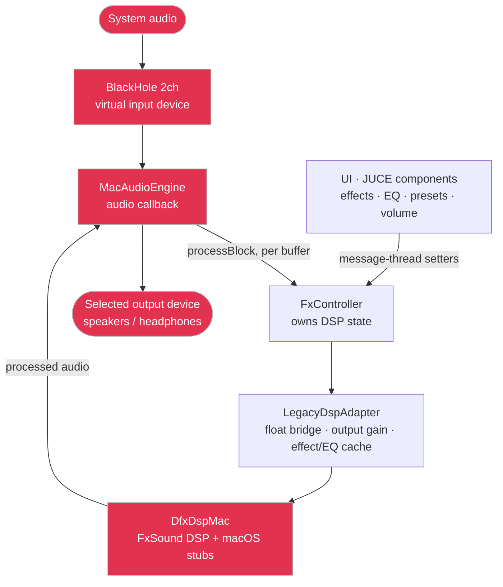

# FxSound for macOS

A community-driven **macOS port of [FxSound](https://www.fxsound.com/)** — the
real-time system-wide audio enhancer (EQ, clarity, bass, dynamic boost) that
many people know from Windows. This repo lets you **clone it and build a native
universal (Apple Silicon + Intel) app in one command**.

> Built on the open-source FxSound project by **FxSound LLC**, released under the
> GNU AGPL v3. This is an independent macOS port maintained by the community —
> not affiliated with or endorsed by FxSound LLC. It is a *modified version* of
> the original work (ported from Windows/JUCE to macOS), distributed under the
> same AGPL v3 license. See [`LICENSE`](LICENSE).

---

## Quick start

```bash
git clone https://github.com/okku007/fxsound-macos.git
cd fxsound-macos
./setup.sh
```

`setup.sh` checks your dependencies, builds a Release universal binary, and
launches the app. First run takes a few minutes (it downloads JUCE and compiles).

Because **you** build it locally, macOS signs it for your own machine — there is
**no "unidentified developer" / Gatekeeper warning**.

## Requirements

`setup.sh` installs what it can. You need:

| Dependency | Why | Install |
|------------|-----|---------|
| macOS 13 (Ventura) or newer | minimum target | — |
| Xcode Command Line Tools | clang + build system | `xcode-select --install` (script offers this) |
| CMake | configures the build | `brew install cmake` (script does this) |
| BlackHole 2ch | virtual device FxSound captures system audio from | `brew install --cask blackhole-2ch` (script does this) |

[Homebrew](https://brew.sh) is recommended so the script can auto-install CMake
and BlackHole. Without it, install those two manually and re-run.

## How to use it

FxSound sits **between your system audio and your speakers**, using BlackHole as
the capture device:

1. Launch FxSound, pick your **real output device**, click **Start**.
2. Open **System Settings → Sound → Output** and select **"BlackHole 2ch"**.
3. All system audio now flows: apps → BlackHole → FxSound (enhanced) → your device.

Switch the output device inside FxSound at any time — audio follows the new
selection live. To stop, click **Stop** in FxSound and set System Settings
output back to your speakers.

## Manual build (without the script)

```bash
cd FxSoundMac
cmake -B build -G Xcode -DCMAKE_OSX_ARCHITECTURES="arm64;x86_64"
cmake --build build --config Release --target FxSoundMac
open build/FxSoundMac_artefacts/Release/FxSound.app
```

## Architecture



`MacAudioEngine` opens a single `AudioDeviceManager` route: BlackHole (input) → DSP → selected output
device. The UI sets DSP state on `FxController` from the message thread, while the audio callback runs
`processBlock` on the audio thread (no locks or allocation in that path). The Windows-only sources under
`dsp/` and `audiopassthru/` are read-mostly legacy, compiled into the `DfxDspMac` static library with
thin macOS shims.

## Repo layout

```
FxSoundMac/      the macOS app — standalone CMake/JUCE project
dsp/             FxSound's DSP engine (legacy, compiled into the app)
audiopassthru/   legacy audio sources referenced by the DSP build
setup.sh         clone-and-run bootstrapper
```

## Related projects

This is the lightweight **clone-and-build** distribution of the macOS port. The
fuller development repository (tests, build history, dev notes) and the original
Windows project live here:

| Project | Link |
|---------|------|
| macOS port — development repo | https://github.com/okku007/fxsound-mac |
| FxSound (original, Windows) — upstream | https://github.com/fxsound2/fxsound-app |
| FxSound website | https://www.fxsound.com |
| BlackHole virtual audio device | https://github.com/ExistentialAudio/BlackHole |

## Donate

If this macOS port is useful to you, a small tip keeps it going. Thank you 🙏

[](https://paypal.me/okku007)
[](https://okku007.github.io/fxsound-macos/donate.html)

- **International** — PayPal (button above).
- **India (UPI)** — the Buy Me a Samosa button.

This supports the macOS port specifically — to back the upstream Windows project, use
the FxSound link in [Related projects](#related-projects) above.

## License

GNU Affero General Public License v3.0 — see [`LICENSE`](LICENSE). Original
FxSound © FxSound LLC. Modifications for macOS © their respective contributors,
released under the same license.
